<br>
# Getting Started with Create React App

In this github repo, we will create a eCommerce Frontend web application, ReactJS will be used as the frontend framework. The frontend will interact with the backend API to handle:
<br><br>
✅ User Signup <br>
✅ User Signin<br>
✅ Add Product<br>
✅ Get Products<br>
✅ Make Payment - LIPA NA MPESA<br>
<br>

Please check the Backend API Implementation here. <br>
https://github.com/modcomlearning/BackendAPI
<br/>

By the end of this repo, you will create an eCommerce web application similar to https://sokogarden.vercel.app/<br>


### Step 1 : Create React App, File Structure, Run App.
This project was bootstrapped with [Create React App](https://github.com/facebook/create-react-app).

In your class Main folder, create a react app using below command
```
   npx create-react-app sokogarden
```

Below is the App Structure Explained<br>

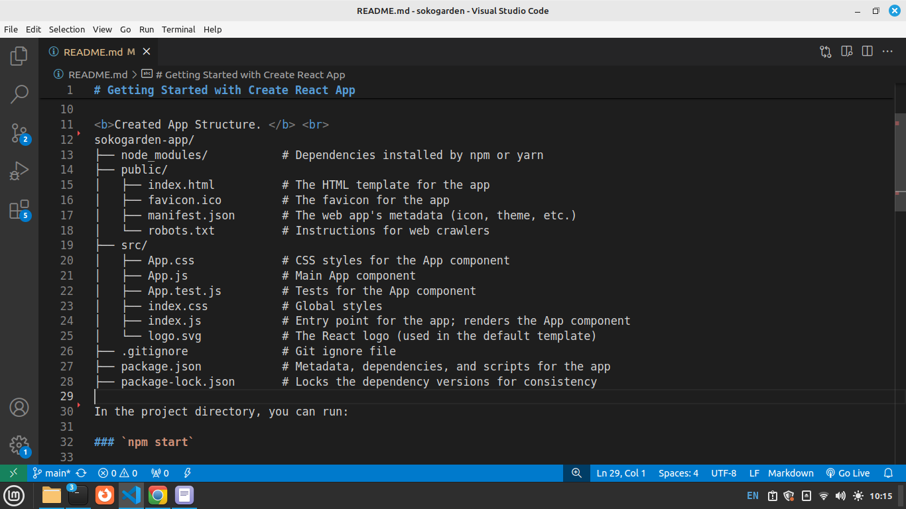

Runs the app in the development mode.\
Open [http://localhost:3000](http://localhost:3000) to view it in your browser.

The page will reload when you make changes.\
You may also see any lint errors in the console.


Your React App runs as below on the browser.

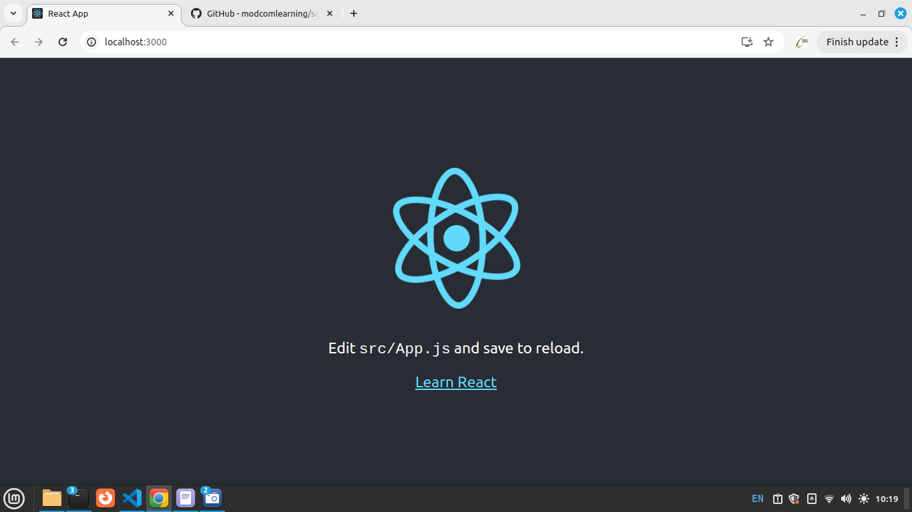

Lets Edit our App.
in src Folder open App.js and remove the higlighted code(remove everything Inside header tags) in below screen.

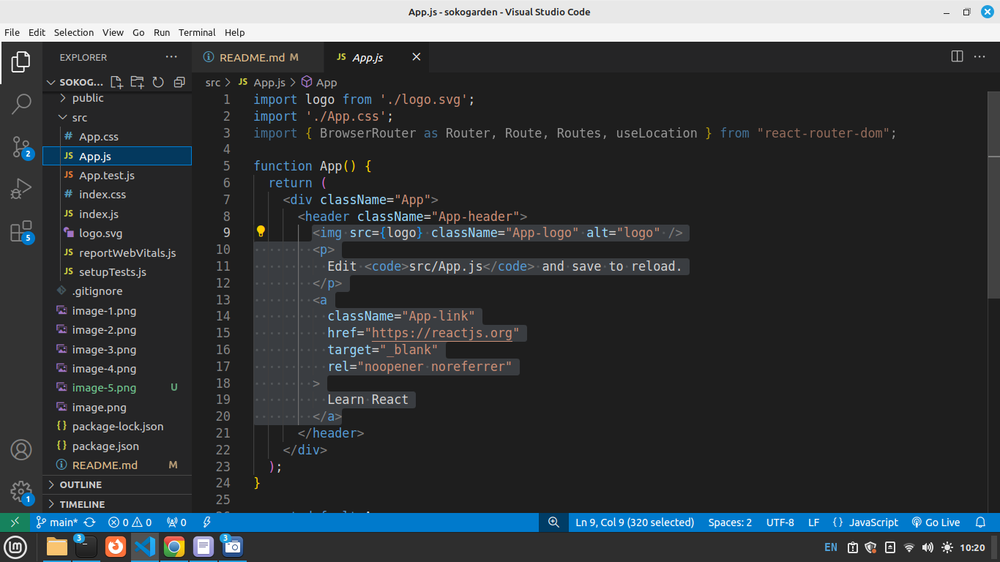


Replace the code you removed with a heading and as shown below.
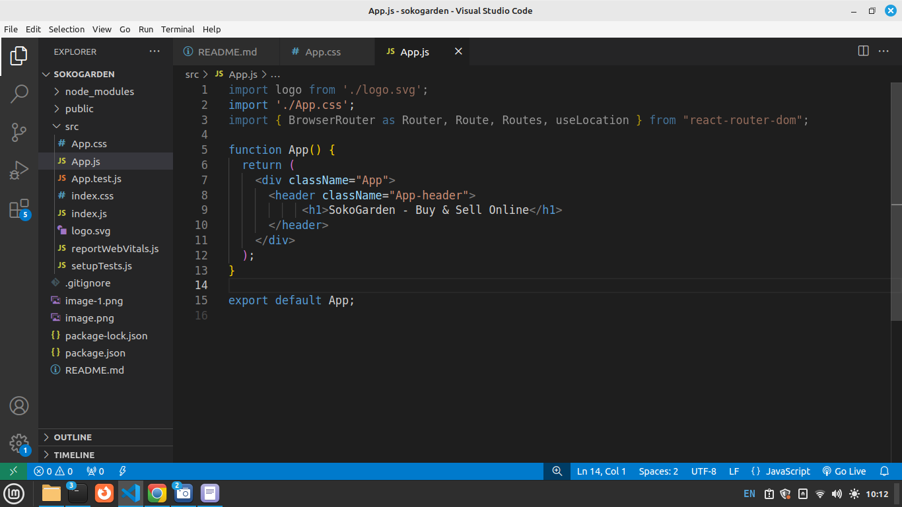


Run your App <br>
Runs the app in the development mode.\
Open [http://localhost:3000](http://localhost:3000) to view it in your browser.
<br>


<br>
<b>Install React Router </b> <br>
```
   npm install react-router-dom
   npm install bootstrap
   npm install axios
```

React Router will be used to create navigation in our App.  <br>
Bootstrap will provide CSS Classes for styling.<br>
Axios will be used in Accessing our Backend APIs created earlier<br>
<br>

in App.js add below import to make bootstrap available in your App.
```jsx
import 'bootstrap/dist/css/bootstrap.min.css';
```

In App.css, Please change the min-height to 20vh, see below, This reduces the height of the Main App.js component display.

```css
.App-header {
  background-color: #282c34;
  min-height: 20vh;
  display: flex;
  flex-direction: column;
  align-items: center;
  justify-content: center;
  font-size: calc(10px + 2vmin);
  color: white;
}
```


Run your App <br>
Runs the app in the development mode.\
Open [http://localhost:3000](http://localhost:3000) to view it in your browser.

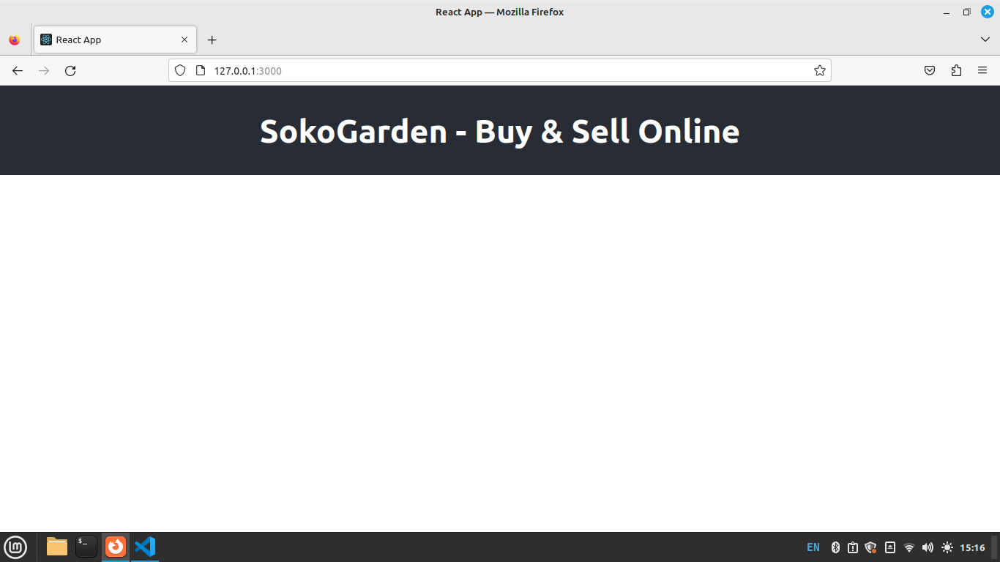


### Step 2: Components Creation
In this Project we will have Components to represent different user interfaces. i.e Signup, Signin, GetProducts, Addproducts, MakePayment, Navbar, Footer etc <br>

Above components MUST be created inside the src Folder,
in src Folder, create a subfolder named components. <br>

Right Click on components folder you created above - Select New File - File name Enter - Signup.js.

Inside Signup.js type below code.

```javascript
  const Signup = () => {
    return (
        <div>
            <h1>Welcome to Signup Component</h1>
        </div>
      );
}
 
export default Signup;
```

Right Click on components folder - Select New File - File name Enter - Signin.js.

Inside Signin.js type below code.

```javascript
const Signin = () => {
    
    return ( 
        <div>
            <h1>Welcome to Signup Component</h1>
        </div>
     );
}
 
export default Signin;

```

Right Click on components folder - Select New File - File name Enter - Addproduct.js.

Inside Addproduct.js type below code.

```javascript
    const Addproduct = () => {
        return ( 
            <div>
                <h1>Welcome to Add Products Component</h1>
            </div>
        );
    }
    
    export default Addproduct;

```
Right Click on components folder - Select New File - File name Enter - Getproducts.js.

Inside Getproducts.js type below code.

```javascript
const Getproducts = () => {
    return ( 
        <div>
            <h1>Welcome to Get Products Components</h1>
        </div>
     );
}

export default Getproducts;
```

We now have 4 different Components.
We need to create routing/navigation for them.This means how do we access them on the browser.

### Step 3: Routing
In this Step we will create Router for our App.
in App.js add below import for routing capabilities
 ```javascript
    import { BrowserRouter, Route, Routes} from "react-router-dom";
```
Then inside the App.js, under the JSX code, wrap the 'DIV' with a Router

```javascript
import logo from './logo.svg';
import './App.css';
import { BrowserRouter, Route, Routes, useLocation } from "react-router-dom";


function App() {
  return (

    <Router>   
      <div className="App">
            <header className="App-header">
                <h1>SokoGarden - Buy & Sell Online</h1>
            </header>

            
          
      </div>
    </Router>

  );
}

export default App;
```

Below the header tag add below routes.
```jsx
    <Routes>
        <Route path="/signup" element={<Signup />} />
        <Route path="/signin" element={<Signin />} />
        <Route path="/addproduct" element={<Addproduct />} />
        {/* This is the default component */}
        <Route path="/" element={<Getproducts/>} />
    </Routes>
```


This code defines client-side routing in a React application using React Router. Here's a breakdown:

```jsx 
<Routes>: A wrapper that holds multiple <Route> components and ensures only one matching route is rendered at a time.

<Route path="/signup" element={<Signup/>} />: When the URL is /signup, the Signup component is rendered.

<Route path="/signin" element={<Signin />} />: When the URL is /signin, the Signin component is rendered.

<Route path="/addproduct" element={<Addproduct />} />: When the URL is /addproduct, the Addproduct component is rendered.

<Route path="/" element={<Getproducts/>} />: Acts as the default (home) route, rendering Getproducts when the path is /.<br><br>
```

Your Full App.js Code after adding the Router Code
```jsx
import logo from './logo.svg';
import './App.css';
import { BrowserRouter, Route, Routes, useLocation } from "react-router-dom";
import Signup from './components/Signup';
import Signin from './components/Signin';
import Addproduct from './components/Addproduct';
import Getproducts from './components/Getproducts';

function App() {
  return (
    <BrowserRouter>
    <div className="App">
          <header className="App-header">
              <h1>SokoGarden - Buy & Sell Online</h1>
          </header>
           <Routes>
            <Route path="/signup" element={<Signup />} />
            <Route path="/signin" element={<Signin />} />
            <Route path="/addproduct" element={<Addproduct />} />
            {/* This is the default component */}
            <Route path="/" element={<Getproducts/>} />
          </Routes>
    </div>
    </BrowserRouter>
  );
}

export default App;
```

<b>Test Your Routes in the Browser. </b><br>
Signup use:   http://127.0.0.1:3000/signup  <br>
Signin use: http://127.0.0.1:3000/signin<br>
Add Products use: http://127.0.0.1:3000/addproducts<br>
Get products use: http://127.0.0.1:3000/<br>


### Step 4a: Signup
In this Step we will work on Signup component, This component connect to the backend through the signup API created in https://github.com/modcomlearning/BackendAPI(Step4) <br>  NB: Please check Full component code at the end of this Step.
<br>
Open Signup.js Component and import below modules to be used in our code.
Put them before the arrow function 

```jsx
import { useState } from "react";  // for state management
import { Link } from "react-router-dom"; //for routing
import axios from "axios"; //For backend API access
```

Next, we create a signup form in JSX. the form has username, email, password, phone input Fields.
Updated Signup.js Code.

```jsx
import { useState } from "react"; //used for state management
import { Link} from "react-router-dom"; //used for routing
import axios from "axios"; //used for API access

//Arrow function
const Signup = () => {

  return (
    <div className="row justify-content-center mt-4">
      <div className="col-md-6 card shadow p-4">
            
            <h2>Sign Up</h2>
            <form>
                <input
                  type="text"
                  className="form-control"
                  placeholder="Enter Username"
                  required
                /> <br />
               
             
                <input
                  type="email"
                  className="form-control"
                  placeholder="Enter Email"
                  required /> <br />
            
                <input
                  type="password"
                  className="form-control"
                  placeholder="Enter Password"
                  required
                /> <br />
        
             
                <input
                  type="text"
                  className="form-control"
                  placeholder="Enter Phone"
                  required
                /> <br />
          
              <button type="submit" className="btn btn-primary">
                Sign Up
              </button>
            </form>
        
              Already have an account? <Link to="/signin">Sign In</Link>
           
      </div>
    </div>
  );
};

export default Signup;
```

Run your App <br>
Runs the app in the development mode.\
Open [http://localhost:3000/signup](http://localhost:3000/signup) to view it in your browser.

Output - A Signup Form.

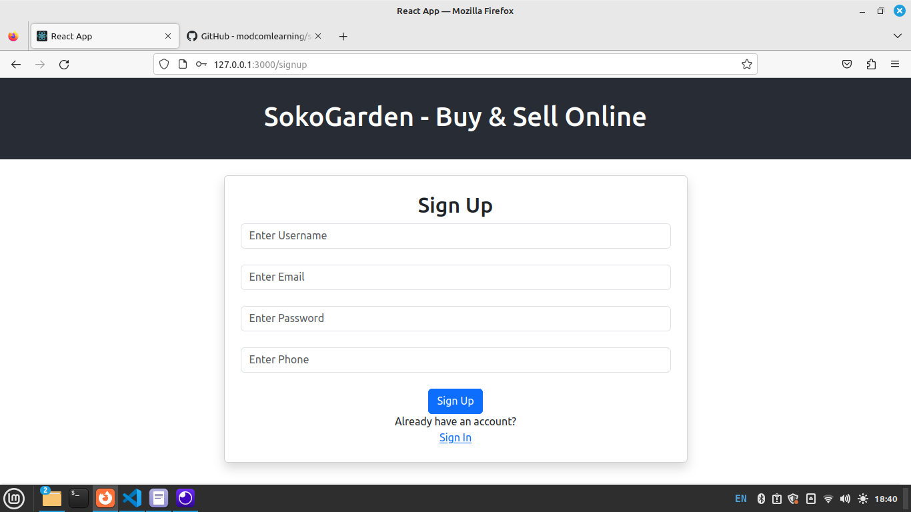


Then inside the Arrow function, Create below hooks.

```jsx
  //Below hooks are set to "" since the variables hold no data/strings
  //The hooks will be updated later in this Program
  const [username, setUsername] = useState("");
  const [email, setEmail] = useState("");
  const [password, setPassword] = useState("");
  const [phone, setPhone] = useState("");

```


In JSX Part update your form. <br>
Please Note in below input we update the Hooks defined above using <b>onChange</b> onChange function is called when user enter an input. i.e username<br>   onChange calls the hooks updater function i.e setUsername().
<br>

```jsx
  return (
    <div className="row justify-content-center mt-4">
      <div className="col-md-6 card shadow p-4">
            
            <h2>Sign Up</h2>
            <form>
             
                <input
                  type="text"
                  className="form-control"
                  placeholder="Enter Username"
                  value={username}
                  onChange={(e) => setUsername(e.target.value)}
                  required
                /> <br />
                  {/* Below for testing onChange() concept */}
                 {username}
              
             
                <input
                  type="email"
                  className="form-control"
                  placeholder="Enter Email"
                  value={email}
                  onChange={(e) => setEmail(e.target.value)}
                  required /> <br />
            
                <input
                  type="password"
                  className="form-control"
                  placeholder="Enter Password"
                  value={password}
                  onChange={(e) => setPassword(e.target.value)}
                  required
                /> <br />
        
             
                <input
                  type="text"
                  className="form-control"
                  placeholder="Enter Phone"
                  value={phone}
                  onChange={(e) => setPhone(e.target.value)}
                  required
                /> <br />
          
                <button type="submit" className="btn btn-primary">
                    Sign Up
                </button>
            </form>
        
              Already have an account? <Link to="/signin">Sign In</Link>
      </div>
    </div>
  );

  ```
  <b>NB: In above code, for simplicity, you can do each hook at a time. i.e initialize the username hook, then bind it in the username input and do the onChange().   Then repeat the same for other inputs.</b>

  Run your App <br>
  Runs the app in the development mode.\
  Open [http://localhost:3000/signup](http://localhost:3000/signup) to view it in your browser.
  <br>
  Type username and observe how the username hook updates as you type.

  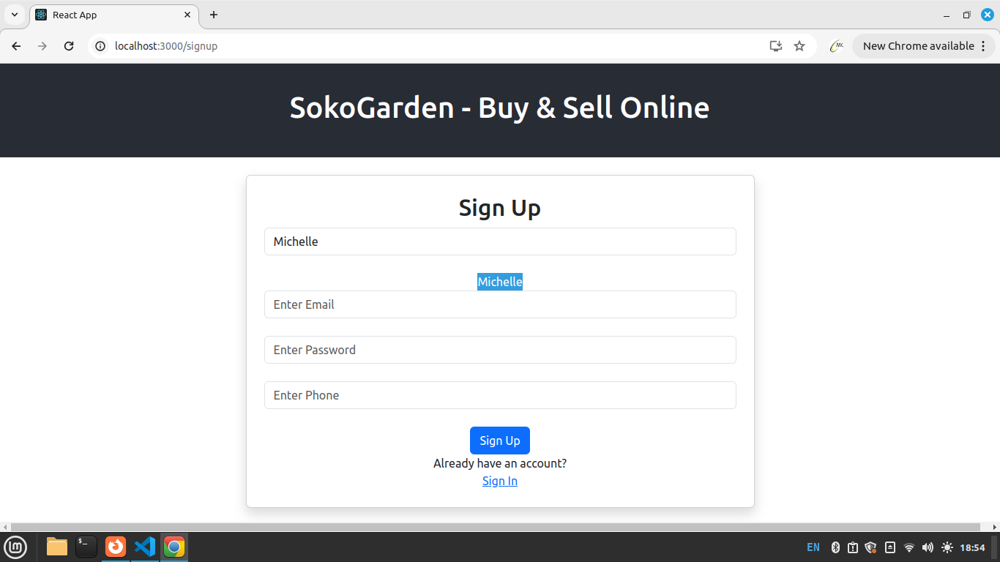

  Above, we typed username "Michelle" and it displays/binds it in realtime. This shows that the username Hook variable updates as you type (onChange)<br>

<br>
 Here we explain what is happening on the inputs, we use username input in our explanation <br>

<b>&lt;input type="text" />: </b></br>
    This is an HTML input element where the user can type text (in this case, a username). <br>

<b>className="form-control":</b>
    This is a CSS class that likely styles the input field. In React, we use className instead of class for applying styles.<br>

<b>placeholder="Enter Username":</b>
    This is the text that appears inside the input field when it’s empty. It gives a hint to the user about what to type, in this case, a username.<br>

<b>value={username}:</b>
    This links the value of the input field to a state variable called username. This means the input field will display whatever value is stored in the username state.<br>

<b>onChange={(e) => setUsername(e.target.value)}:</b>
    This defines what happens when the user types into the input field. It updates the username state with whatever the user types, so the value in the input is always in sync with the state.<br>

<b>required:</b>
    This makes the input field mandatory, meaning the user must fill it out before submitting a form.<br>

<b>&lt;br /&gt; :</b>
    This just adds a line break (an empty space) after the input field.


### Step 4b: Signup
Now we've created Hooks, a form that updates the hooks on input change(onChange).


In Signup.jsx, create below hooks for loading, success and error messages.
We set below hooks to empty strings, to be updated later in this program.
<br>

```jsx
  const [success, setSuccess] = useState("");
  const [error, setError] = useState("");
  const [loading, setLoading] = useState("");
```

Next, we need to create a function to submit the data to our API.
inside the arrow function of Signup.js, add below function. This function will collect updated input data(Stored in Hooks) and post to our Backend API

```javascript
    //create function
    const submit = async (e) => {
        // Prevents JS default actions as we need to do our own action below
        e.preventDefault();
        //set loading hook variable to true, show loading message
        setLoading("Please wait as we upload your data!");

        try {
        //append updated hooks variables into data varaible 
        const data = new FormData();
        data.append("username", username);
        data.append("email", email);
        data.append("password", password);
        data.append("phone", phone);

        //use axios to post above data to our Backend API
        const response = await axios.post(
            "https://modcom2.pythonanywhere.com/api/signup",
            data
        );
          //Set loading variable to empty string. 
        setLoading("");
      
        //Update success message upon successful data submission/post
        setSuccess(response.data.message);


        // Clear form fields
        setUsername("");
        setEmail("");
        setPassword("");
        setPhone("");

        //Catch errora/Exeptions
        } catch (error) {
        setLoading("");
        setError(error.message);
        }
    };

```

Next, go back to your form opening tag and add a <b>onSubmit</b> attribute to call the <b>submit</b> function you created above.

```jsx
   <form onSubmit={submit}>
```

<br>
After calling the submit function we need to bind loading, success and error hooks inside the form. These will show loading, success and error messages.
<br>

So, add below inside the form tag

```jsx
 {loading}
 {success}
 {error}
```
<br>
Done.

<b>Full Signup.js Code.</b><br>

```jsx

import { useState } from "react"; //used for state management
import { Link} from "react-router-dom"; //used for routing
import axios from "axios"; //used for API access

//Arrow function
const Signup = () => {
    //Initialize Hooks
  const [username, setUsername] = useState("");
  const [email, setEmail] = useState("");
  const [password, setPassword] = useState("");
  const [phone, setPhone] = useState("");
  const [success, setSuccess] = useState("");
  const [error, setError] = useState("");
  const [loading, setLoading] = useState("");

  //submit function
  const submit = async (e) => {
    e.preventDefault(); // prebent default JS actions
    //Update loading Hook with a message
    setLoading("Please wait as we upload your data!");

    try {
      // Put updated hooksin data variable
      const data = new FormData();
      data.append("username", username);
      data.append("email", email);
      data.append("password", password);
      data.append("phone", phone);

      //post your data to your Backend API
      const response = await axios.post(
        "https://modcom2.pythonanywhere.com/api/signup",
        data
      );
      //After data has been posted, set success hook variable to empty
      setLoading("");
      //Update success hook with a success message
      setSuccess(response.data.message);


      // Clear form fields
      setUsername("");
      setEmail("");
      setPassword("");
      setPhone("");

    //Catch any errors/exceptions
    } catch (error) {
      setLoading("");//Update loading hook variable  to empty
      setError(error.message);
    }
  };

  return (
    <div className="row justify-content-center mt-4">
      <div className="col-md-6 card shadow p-4">
            
            <h2>Sign Up</h2>
            <form onSubmit={submit}>
                {loading}
                {success}
                {error}
             
                <input
                  type="text"
                  className="form-control"
                  placeholder="Enter Username"
                  value={username}
                  onChange={(e) => setUsername(e.target.value)}
                  required
                /> <br />
                {username}
             
             
                <input
                  type="email"
                  className="form-control"
                  placeholder="Enter Email"
                  value={email}
                  onChange={(e) => setEmail(e.target.value)}
                  required /> <br />
            
                <input
                  type="password"
                  className="form-control"
                  placeholder="Enter Password"
                  value={password}
                  onChange={(e) => setPassword(e.target.value)}
                  required
                /> <br />
        
             
                <input
                  type="text"
                  className="form-control"
                  placeholder="Enter Phone"
                  value={phone}
                  onChange={(e) => setPhone(e.target.value)}
                  required
                /> <br />
          
              <button type="submit" className="btn btn-primary">
                Sign Up
              </button>
            </form>
        
              Already have an account? <Link to="/signin">Sign In</Link>
           
      </div>
    </div>
  );
};

export default Signup;
```

Run your App <br>
Runs the app in the development mode.\
Open [http://localhost:3000/signup](http://localhost:3000/signup) to view it in your browser.

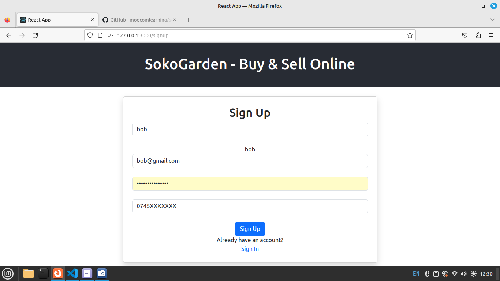
<br>
Fill in the Details in the form and click sign up.


### Step 5a: Signin
In this step, we create a login form. This form will communicate with API created in https://github.com/modcomlearning/BackendAPI(Step5).

Open Signin.js<br/>
Create below form 

```jsx
import React, { useState } from "react"; //for state management
import { Link, useNavigate } from "react-router-dom";  //for routing/navigation
import axios from "axios"; //for API Access

const Signin = () => {
  // We create a Login form
  return (
    <div className="row justify-content-center mt-5">
      <div className="col-md-6 card shadow p-4">
            <h2>Sign In</h2>
            <form>
              <input
                type="email"
                className="form-control mb-3"
                placeholder="Email"
                required
              />
              <input
                type="password"
                className="form-control mb-3"
                placeholder="Password"
                required
              />
              <button type="submit" className="btn btn-primary w-100">
                Sign In
              </button>
            </form>

              Don't have an account? <Link to="/signup">Sign Up</Link>
        
      </div>
    </div>
  );
};

export default Signin;
```

Run your App <br>
Runs the app in the development mode.\
Open [http://localhost:3000/signin](http://localhost:3000/signin) to view it in your browser.


In your Signin Arrow function, initialize below hooks
```jsx
  const [email, setEmail] = useState(""); //email hook variable
  const [password, setPassword] = useState(""); //password hook variable
  const [loading, setLoading] = useState(""); //loading hook variable
  const [error, setError] = useState(""); //error hook variable

  const navigate = useNavigate(); // For redirection
```


Next, Update your hooks in the input tags using onChange atribute, see below.

```jsx
import React, { useState } from "react"; //for state management
import { Link, useNavigate } from "react-router-dom";  //for routing/navigation
import axios from "axios"; //for Backend API Access

const Signin = () => {
  // We create a Login form
  
  const [email, setEmail] = useState("");//email hook variable
  const [password, setPassword] = useState(""); //password hook variable
  const [loading, setLoading] = useState("");//loading hook variable
  const [error, setError] = useState("");//error hook variable

  const navigate = useNavigate(); // For redirection to another Component

  return (
    <div className="row justify-content-center mt-5">
      <div className="col-md-6 card shadow p-4">
            <h2>Sign In</h2>
            <form>
              <input
                type="email"
                className="form-control mb-3"
                placeholder="Email"
                value={email}
                onChange={(e) => setEmail(e.target.value)}
                required
              />
              <input
                type="password"
                className="form-control mb-3"
                placeholder="Password"
                value={password}
                onChange={(e) => setPassword(e.target.value)}
                required
              />
              <button type="submit" className="btn btn-primary w-100">
                Sign In
              </button>
            </form>

              Don't have an account? <Link to="/signup">Sign Up</Link>
      </div>
    </div>
  );
};

export default Signin;
```

### Step 5b: Signin
Next, In your Arrow function, Create a submit function to handle data submission to Backend API.

```jsx
  //Function to submit data to API
  const submit = async (e) => {
    e.preventDefault();//Prevent default actions
    setLoading("Please wait as we log you in");//set progress message
  
    //Add data to form data object
    try {
      const data = new FormData();
      data.append("email", email);
      data.append("password", password);

      //Post above data to Backend API
      const response = await axios.post(
        "https://modcom2.pythonanywhere.com/api/signin",
        data);

      setLoading(""); //After successful posting, Clear the loading message

      // Check if the response has user item,
    
      if (response.data.user) {
        // If user is Found, Store user details in localStorage
        localStorage.setItem("user", JSON.stringify(response.data.user));
        // Redirect to /getproducts Component
        navigate("/");
      } 
      else {
        //User Not Found, Show Error message
        setError(response.data.message);
      }
      //If there was an Error, Clear Loading
    } catch (error) {
      setLoading("");
      setError(error.response.data.message);
    }
  };
```


Finally, We need to Call submit function created above when a user clicks a the signin button. <br/> In your Form openning tag, add an onSubmit attribute and Call the submit function.

In addition, we need to see the loading and error messages in our Form, Bind/Fix the loading and error hooks inside your form tag.  See below code snippet.<br/>

```jsx
<form onSubmit={submit}>
    {loading}
    {error}
    ....
```


<b>Full Code for Signin.js</b> <br/>

```jsx
import { useState } from "react"; //for state management
import { Link, useNavigate } from "react-router-dom";  //for routing/navigation
import axios from "axios"; //for API Access

const Signin = () => {

  // Initialize hooks to be used in this component.
  const [email, setEmail] = useState("");  //email hook
  const [password, setPassword] = useState(""); //password hook
  const [loading, setLoading] = useState(""); //laoding hook
  const [error, setError] = useState(""); //error hook

  const navigate = useNavigate() //hook for navigating to a new component


  //Function to submit data to API
  const submit = async (e) => {
    e.preventDefault();//Prevent default actions
    setLoading("Please wait as we log you in");//set progress message
  
    //Add data to form data object
    try {
      const data = new FormData();
      data.append("email", email);
      data.append("password", password);

      //Post above data to Backend API
      const response = await axios.post(
        "https://modcom2.pythonanywhere.com/api/signin",
        data);

      setLoading(""); //After successful posting, Clear the loading message

      // Check if the response has user item,
    
      if (response.data.user) {
        // If user is Found, Store user details in localStorage
        localStorage.setItem("user", JSON.stringify(response.data.user));
        // Redirect to /getproducts Component
        navigate("/");
      } 
      else {
        //User Not Found, Show Error message
        setError(response.data.message);
      }
      //If there was an Error, Clear Loading
    } catch (error) {
      setLoading("");
      setError(error.data.message);
    }
  };

  return (
    <div className="row justify-content-center mt-5">
      <div className="col-md-6 card shadow p-4">
            <h2>Sign In</h2>
            <form onSubmit={submit}>
              {loading}
              {error}
              <input
                type="email"
                className="form-control mb-3"
                placeholder="Email"
                value={email}
                onChange={(e) => setEmail(e.target.value)}
                required
              />Detials
              <input
                type="password"
                className="form-control mb-3"
                placeholder="Password"
                value={password}
                onChange={(e) => setPassword(e.target.value)}
                required
              />
              <button type="submit" className="btn btn-primary w-100">
                Sign In
              </button>
            </form>

              Don't have an account? <Link to="/signup">Sign Up</Link>
        
      </div>
    </div>
  );
};

export default Signin;

```


Run your App <br>
Runs the app in the development mode.\
Open [http://localhost:3000/signin](http://localhost:3000/signin) to view it in your browser.

<br/>
Fill in the Details in the form and click sign in.  If user credenatials provided are wrong, You will get an error saying Login Failed, else if user credentials are right, it will navigate to getproducts Component.
<br/>
See below screenshot for wrong credentials.

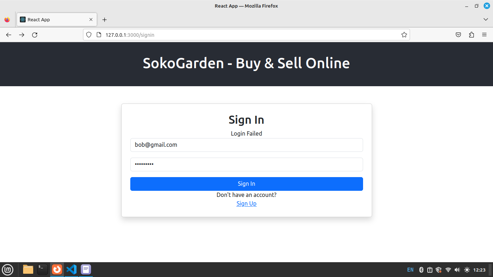


### Step 6a: Add/Upload Product  - Form, Hooks
In this step we will be Uploading/Adding product to our API created in  https://github.com/modcomlearning/BackendAPI  (Step 6). <br>  Add_product API Demo.
<br>

Next, create a HTML form for product upload. <br>
In your React App Open Addproduct.js and import below modules.

```jsx
import { useState } from "react"; // for variable state mangement
import axios from "axios"; //for API Access
import { Link } from "react-router-dom"; //for components linking
```

Next, Create the Upload HTML Form in JSX <br>

```jsx
//Imports
import { useState } from "react";// for variable state mangement
import axios from "axios";//for API Access
import { Link } from "react-router-dom"; //for components linking

const Addproduct = () => {
  
  //  Do HTML product Upload Form
  return (
    <div className="row justify-content-center mt-4">
      <div className="col-md-6 card shadow p-4">
        <form>
            <h3>Upload Products</h3>
             {/* Call setProductName onChange to update  produce name Hook */}
            <input
              type="text"
              placeholder="Enter Product Name"
              className="form-control"
              required
            /> 
            <br />
            {/* Call setProductDescription onChange to update  produce description Hook */}
           <textarea
              className="form-control"
              placeholder="Describe your Product"
              required
            ></textarea>
            <br />
      
              {/* Call setProductCost onChange to update  produce cost Hook */}
            <input
              type="number"
              placeholder="Enter Product Cost"
              className="form-control"
              required
            />
            <br />
        
                {/* Call setProductPhoto onChange to update  produce photo Hook */}
             <b>Browse/Upload Product Image</b>
            <input
              type="file"
              className="form-control"
              accept="image/*"
              required
            />
            <br />
     
          <button type="submit" className="btn btn-primary">
               Upload Product
          </button>
        </form>
      </div>
    </div>
  );
};

export default Addproduct;
```
<br>

Run your App <br>
Runs the app in the development mode.\
Open [http://localhost:3000/add_product](http://localhost:3000/add_product) to view it in your browser.
<br>

Output.<br>

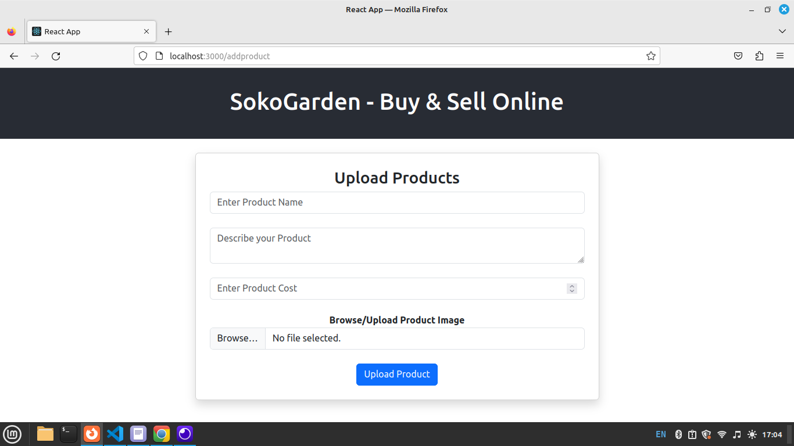

<br>

Next, Initialize below Hooks that will hold our input values,The hooks are initialized to empty strings, meaning they hold no value.<br>
They will be updated when the user types values on the input using onChange().

Below is the updated Code with Hooks initialized and Updated onChange() of inputs.<br>

```jsx
  //Initialize product details hooks
  const [product_name, setProductName] = useState("");
  const [product_description, setProductDescription] = useState("");
  const [product_cost, setProductCost] = useState("");
  const [product_photo, setProductPhoto] = useState("");
```


Below is the Code with Hooks <br>

```jsx
//Imports
import { useState } from "react";// for variable state mangement
import axios from "axios";//for API Access
import { Link } from "react-router-dom"; //for components linking

const Addproduct = () => {

  //Initialize below Hooks
  const [product_name, setProductName] = useState("");
  const [product_description, setProductDescription] = useState("");
  const [product_cost, setProductCost] = useState("");
  const [product_photo, setProductPhoto] = useState("");

  //  Do HTML product Upload Form
  return (
    <div className="row justify-content-center mt-4">
      <div className="col-md-6 card shadow p-4">
        <form>
            <h3>Upload Products</h3>
             {/* Call setProductName onChange to update  produce name Hook */}
            <input
              type="text"
              placeholder="Enter Product Name"
              className="form-control"
              value={product_name}
              onChange={(e) => setProductName(e.target.value)}
              required
            /> 
            <br />
            {/* Call setProductDescription onChange to update  produce description Hook */}
           <textarea
              className="form-control"
              placeholder="Describe your Product"
              value={product_description}
              onChange={(e) => setProductDescription(e.target.value)}
              required
            ></textarea>
            <br />
      
              {/* Call setProductCost onChange to update  produce cost Hook */}
            <input
              type="number"
              placeholder="Enter Product Cost"
              className="form-control"
              value={product_cost}
              onChange={(e) => setProductCost(e.target.value)}
              required
            />
            <br />
        
                {/* Call setProductPhoto onChange to update  produce photo Hook */}
             <b>Browse/Upload Product Image</b>
            <input
              type="file"
              className="form-control"
              accept="image/*"
              onChange={(e) => setProductPhoto(e.target.files[0])}
              required
            />
            <br />
     
          <button type="submit" className="btn btn-primary">
               Upload Product
          </button>
        </form>
      </div>
    </div>
  );
};

export default Addproduct;
```


Run your App <br>
Runs the app in the development mode.\
Open [http://localhost:3000/addproduct](http://localhost:3000/addproduct) to view it in your browser.
<br>
NB: we can bind Hooks on UI to find out they are being updated as the user types.


### Step 6b: Add/Upload Product - Submit to API

In Step 6a, we created a Product Upload form and Set up the Hooks to be used.
Next, We do a submit function, This function will collect data from updated Hooks and submit to add_product Backend API.

First initialize below hooks that used to Handle loading, success and Error messages(information messages)<br>

```jsx
    // Hooks for information messages
  const [loading, setLoading] = useState("");
  const [message, setMessage] = useState("");
  const [error, setError] = useState("");
```

Next, Inside Addproduct Arrow Function (Below the Hooks Initialization) create below submit Arrow function.

```jsx
  const submit = async (e) => {
     //TODO
  }
```

Next is submit function Logic<br> This will include capturing product data in updated hooks and POST to our add_product Backend API. <br>

Below is the submit function implementation.

  ```jsx
  //Submit Function
  const submit = async (e) => {
    //Prevent default actions
    e.preventDefault();
    //update loading hook to show progress
    setLoading("Please wait ... ");

    //add all updated hooks to data variable
    const data = new FormData();
    data.append("product_name", product_name);
    data.append("product_description", product_description);
    data.append("product_cost", product_cost);
    data.append("product_photo", product_photo);

    //Post data to Backend API
    try {
      const response = await axios.post(
        "https://modcom2.pythonanywhere.com/api/add_product",
        data
      );
      //Set loding message to empty, after a successful POST to API
      setLoading("")
      //Update message hook to successfully Added to notify the user.
      setMessage("Product Added successfully!");
    //   setMessage(response.data.success);

      // reset the input fields 
      setProductName("");
      setProductDescription("");
      setProductCost("");
      setProductPhoto("");

      //Catch Any server error, i.e internet issues , server errors
    } catch (error) {
      setError("Failed to add product. Please try again.");
    }
  };
```

Here's the function with the explanation broken down line by line:
<br>
<br>
Prevent the default form submission behavior:

```javascript
  e.preventDefault();
```
<br><br>
Displays a loading message while processing the request:

```javascript
  setLoading("Please wait ... ");
```
<br><br>
Collects data from the input fields and appends them to a FormData object:

```javascript
const data = new FormData();
data.append("product_name", product_name);
data.append("product_description", product_description);
data.append("product_cost", product_cost);
data.append("product_photo", product_photo);
```
<br><br>
Sends the collected data to the backend API using a POST request:

```javascript
const response = await axios.post(
  "https://modcom2.pythonanywhere.com/api/add_product",
  data
);
```
<br><br>
If the submission is successful, Clears the loading message so that its stops to display.
Update the loading Hook

```javascript
setLoading("");
```
<br><br>
Update message Hook, Displays a success message:

```javascript
setMessage("Product Added successfully!");
```
<br><br>
Resets the input fields to be empty for the next submission:

```javascript
setProductName("");
setProductDescription("");
setProductCost("");
setProductPhoto("");
```
<br><br>
If there is an error (e.g., network issue or server error), it displays an error message:

```javascript
setError("Failed to add product. Please try again.");
```
<br>
This approach ensures that the process of adding a product to the backend is managed smoothly, with clear feedback to the user for both success and failure scenarios.
<br><br>
Finally, Call the submit() Function onSubmit of the form as shown below and Bind the loading, messages and error hooks in the form to show the user loading, messages and error messages <br>
Inside your form tag add below code. 

```jsx  
{/* Bind user loding, success, error messages */}
<form onSubmit={submit}>
            {loading}
            {message}
            {error}
      .... 
```

Full Addproduct.js Code.<br/>

```jsx
import { useState } from "react"; // for state management
import axios from "axios"; //For API Access
import { Link } from "react-router-dom"; ////For link to other component

const Addproduct = () => {
      //Initialize product details hooks
  const [product_name, setProductName] = useState("");
  const [product_description, setProductDescription] = useState("");
  const [product_cost, setProductCost] = useState("");
  const [product_photo, setProductPhoto] = useState("");
    // Hooks for information messages
  const [loading, setLoading] = useState("");
  const [message, setMessage] = useState("");
  const [error, setError] = useState("");

  //Submit Function
  const submit = async (e) => {
    //Prevent default actions
    e.preventDefault();
    //update loading hook to show progress
    setLoading("Please wait ... ");

    //add all updated hooks to data variable
    const data = new FormData();
    data.append("product_name", product_name);
    data.append("product_description", product_description);
    data.append("product_cost", product_cost);
    data.append("product_photo", product_photo);

    //Post data to Backend API
    try {
      const response = await axios.post(
        "https://modcom2.pythonanywhere.com/api/add_product",
        data
      );
      //Set loding message to empty, after a successful POST to API
      setLoading("")
      //Update message hook to successfully Added to notify the user.
      setMessage("Product Added successfully!");
    //   setMessage(response.data.success);

      // reset the input fields 
      setProductName("");
      setProductDescription("");
      setProductCost("");
      setProductPhoto("");

      //Catch Any server error, i.e internet issues , server errors
    } catch (error) {
      setError("Failed to add product. Please try again.");
    }
  };

 

  return (
    <div className="row justify-content-center mt-4">
      <div className="col-md-6 card shadow p-4">
        <form onSubmit={submit}>
            {/* Bind user loding, success, error messages */}
            {loading}
            {message}
            {error}
            <h3>Upload Products</h3>
            {/* Call setProductName onChange to update  produce name Hook */}
            <input
              type="text"
              placeholder="Enter Product Name"
              className="form-control"
              value={product_name}
              onChange={(e) => setProductName(e.target.value)}
              required
            /> <br />

            {/* Call setProductDescription onChange to update  produce description Hook */}
           <textarea
              className="form-control"
              placeholder="Describe your Product"
              value={product_description}
              onChange={(e) => setProductDescription(e.target.value)}
              required
            ></textarea>
            <br />
      
             {/* Call setProductCost onChange to update  produce cost Hook */}
            <input
              type="number"
              placeholder="Enter Product Cost"
              className="form-control"
              value={product_cost}
              onChange={(e) => setProductCost(e.target.value)}
              required
            />
            <br />
        
             {/* Call setProductPhoto onChange to update  produce photo Hook */}
             <b>Browse/Upload Product Image</b>
            <input
              type="file"
              className="form-control"
              accept="image/*"
              onChange={(e) => setProductPhoto(e.target.files[0])}
              required
            />
            <br />
           {/* submit button */}
          <button type="submit" className="btn btn-primary">
               Upload Product
          </button>
        </form>
      </div>
    </div>
  );
};

export default Addproduct;
```

Run your App  <br>
Runs the app in the development mode.\
Open [http://localhost:3000/addproduct](http://localhost:3000/addproduct) to view it in your browser.
<br>
Fill in product details, browse image from computer and press Upload Product button. The data sent to the add_product API and you get a success message.

Output.<br>


### Step 7a: Get Products

In this step we will be getting all products posted on the API. The get products Backend API implementation can be accessed at https://github.com/modcomlearning/BackendAPI(Step7)<br>

In your React App Open Getproducts.js
<br>

```jsx
const Getproducts = () => {
    return ( 
        <div>
            <h1>Welcome to Get Products Components</h1>
        </div>
     );
}

export default Getproducts;
```

Create a Card to demonstrate how a single product will display, Update the HTML code as follows<br>

```jsx

const Getproducts = () => {


    return (
        <div className="row">
            <h3 className="mt-5">Available Products</h3>
 
            <div className="col-md-3 justify-content-center mb-4">
                {/* Card with equal size */}
                <div className="card shadow card-margin">

                        
                    {/* Card Body with a dummy Product */}
                    <div className="card-body">
                        <h5 className="mt-2">Unga</h5>
                        <p className="text-muted">This is Nice Soft Ugali</p>
                        <b className="text-warning">200 KES</b>  <br />

                    </div>
                </div>
            </div>
    </div>
    );

}

export default Getproducts;
```

Run your App  <br>
Runs the app in the development mode.\
Open [http://localhost:3000/](http://localhost:3000/) to view it in your browser.
<br>

Output<br>
Below shows a Card View of how a Product will be displayed<br>
This a Dummy/Example Product, Not the ones from the Database <br>

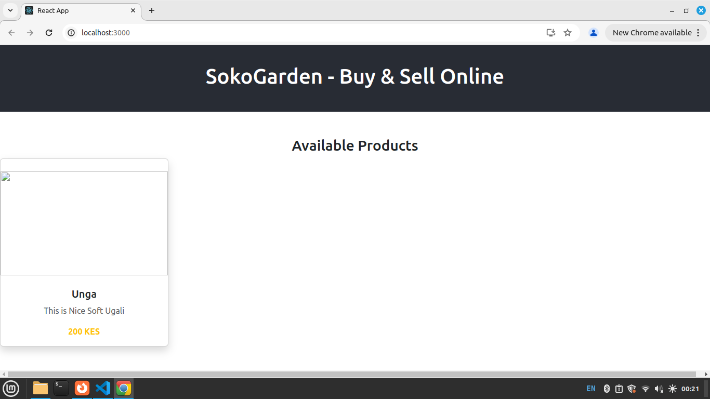

Next, we need to fetch/get all products from our getproducts Backend API and display in the Card we've just seen<br>


Import the required modules 

```jsx
import { useState, useEffect } from "react"; // for state management
import axios from "axios"; //For API Access
import { Link, useNavigate } from "react-router-dom"; // For link/navigate to other component
```


Initialize below Hooks

```jsx
   // Initialize Hooks
    const [products, setProducts] = useState([]);  // Default to empty array instead of a string
    const [loading, setLoading] = useState(""); //For loading message
    const [error, setError] = useState(""); //error message hook
    const navigate = useNavigate(); 
```

Specify the image location URL, this is where the image image files were saved in pythonanywhere.<br>. 
```jsx
   //Specify image location URL
    const img_url = "https://modcom2.pythonanywhere.com/static/images/"
```

Next, write below code snippet to get all records from get_product_details Backend API. <br>
First, Create an Arrow  Function named getproducts() and write below code <br>

```jsx
  const getproducts = async()=>{
        setLoading("Please wait, We are retrieving the products .."); // Set loading message when fetching starts
        try {
        const response = await axios.get("https://modcom2.pythonanywhere.com/api/get_product_details")
        setProducts(response.data)
        setLoading("")
        }
        catch(error){
            setLoading("")
            setError("There was an Error")    
        }
    }//end function
```

Call Above Functions inside useEffect()

```jsx
  useEffect(() => {
       getproducts();
    }, []); // empty dependency array ensures this runs only once when the component mounts
```
<br>
Here's a simple breakdown of what the useEffect hook does:
<br><br/>

<b>Loading State:</b> <br>
setLoading("Please wait, We are retrieving the products .."); sets a loading message while the data is being fetched.
<br><br/>
<b>API Call:</b> <br>
The axios.get("https://modcom2.pythonanywhere.com/api/get_product_details") makes a GET request to the provided API URL to retrieve product details.
<br><br/>
<b>Response Handling: </b> <br>
On try block, The response variable containes the products details and set into the products state using setProducts(response.data).
The loading message is cleared with setLoading("").
<br><br/>
<b>Error Handling: </b> <br>
On error (.catch), an error message is set into the error state with setError("There was an Error").
The loading message is cleared with setLoading("").
<br><br/>

<b>Triggering Fetch on Mount: - useEffect()</b>
<br>
The useEffect hook is used to run a function when the component loads. In this case, it runs the API call to fetch product details when the component first loads. useEffect runs after the component renders.  If you include variables in the array[], useEffect will run whenever those variables change. In our the code inside useEffect run only once when Page loads.
<br>

Inside use Effect, we Call getproducts() function to fetch all products.
<br/><br/>

<b>Summary:</b>
1. The hook fetches data when the component mounts. <br>
2. It shows a loading message while the data is being fetched.<br>
3. It updates the state with fetched data or shows an error if something goes wrong.<br>
<br>


in JSX that we had done earlier, we loop/map through the products from the API and display them in the Card, Update the Card by Removing the Dummy/Example product and bind with the products from your database. Do below code. <br>

```jsx
return (
        <div className="row">

         <h3 className="mt-5">Available Products</h3>

        {/* Bind Error Messages */}
          {loading}
          {error}

        {/* Map over products and display them */}
        {products.length > 0 && products.map((product) => (
            <div className="col-md-3 justify-content-center mb-4">
                {/* Card with equal size */}
                <div className="card shadow card-margin">
                        
                  
                    <div className="card-body">
                        <h5 className="mt-2">{product.product_name}</h5>
                        <p className="text-muted">{product.product_description}</p>
                        <b className="text-warning">{product.product_cost} KES</b>  <br />
                        <button className="btn btn-dark mt-2 w-100">Purchase Now</button>
                    </div>
                </div>
            </div>
        ))}
    </div>
    
    );
  ```


In App.css add below css class to style the image <br>

```css
.product_img {
  object-fit: contain;
  width: 100%;
  height: 200px;
}
```

Full Getproducts.js Code <br>

```jsx
import { useState, useEffect } from "react"; // for state management
import axios from "axios"; //For API Access
import { Link } from "react-router-dom"; // For link to other component

const Getproducts = () => {

    // Initialize Hooks
    const [products, setProducts] = useState([]);  // Default to empty array instead of a string
    const [loading, setLoading] = useState(""); //For loading message
    const [error, setError] = useState(""); //error message hook
    
    //Specify image location URL
    const img_url = "https://modcom2.pythonanywhere.com/static/images/"
    
    const getproducts = async()=>{
        setLoading("Please wait, We are retrieving the products .."); // Set loading message when fetching starts
        try {
        const response = await axios.get("https://modcom2.pythonanywhere.com/api/get_product_details")
        setProducts(response.data)
        setLoading("")
        }
        catch(error){
            setLoading("")
            setError("There was an Error")    
        }
    }//end function

    // Call getproducts on Use Effect
    useEffect(() => {
       getproducts()
    }, []); // empty dependency array ensures this runs only once when the component mounts

    return (
        <div className="row">

         <h3 className="mt-5">Available Products</h3>

        {/* Bind Error Messages */}
          {loading}
          {error}

        {/* Map over products and display them */}
        {products.map((product) => (
            <div className="col-md-3 justify-content-center mb-4">
                {/* Card with equal size */}
                <div className="card shadow card-margin">
                        
                  
                    <div className="card-body">
                        <h5 className="mt-2">{product.product_name}</h5>
                        <p className="text-muted">{product.product_description}</p>
                        <b className="text-warning">{product.product_cost} KES</b>  <br />
                        <button className="btn btn-dark mt-2 w-100">Purchase Now</button>
                    </div>
                </div>
            </div>
        ))}
    </div>
    );

}

export default Getproducts;
```


Run your App <br>
Runs the app in the development mode.\
Open [http://localhost:3000/](http://localhost:3000/) to view it in your browser.
<br>
Output <br>

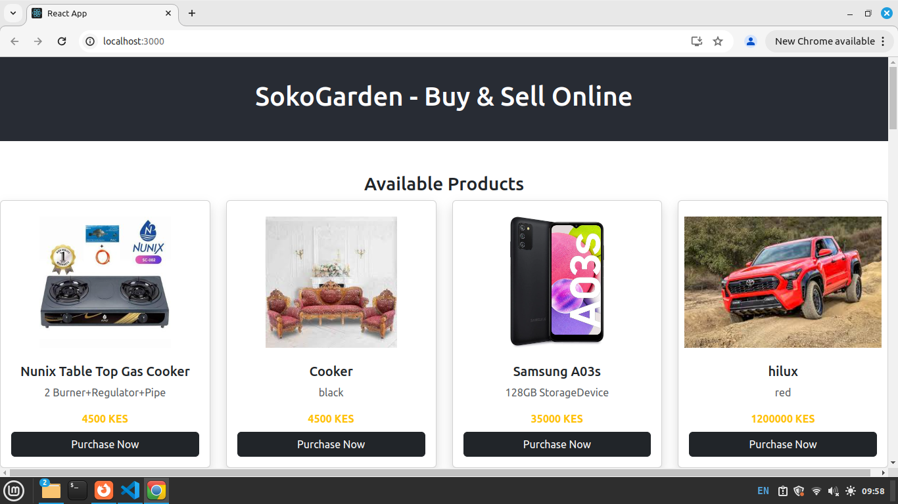


### Step 8: Make Payment - Payment Integration.


In this Step, we implement LIPA NA MPESA, this allows customers to pay for products using MPESA. We will be interacting with our Backend API created in https://github.com/modcomlearning/BackendAPI (Step 8) <br/> API Demo <br/>

In Your React App, Right Click on Components Folder,  
Create a Component named Makepayment.js.

Inside Create the Component Arrow Function and Return JSX Code.
<br>

Makepayment.js
```jsx

const Makepayment = ()=> {

    return(
        <div>
             <h1>Make Payment - Lipa NA MPESA</h1>
        </div>
    )
}

export default Makepayment;
```

In App.js add a Route to Makepayment.js Component, Open App.js and add the Route as shown below.

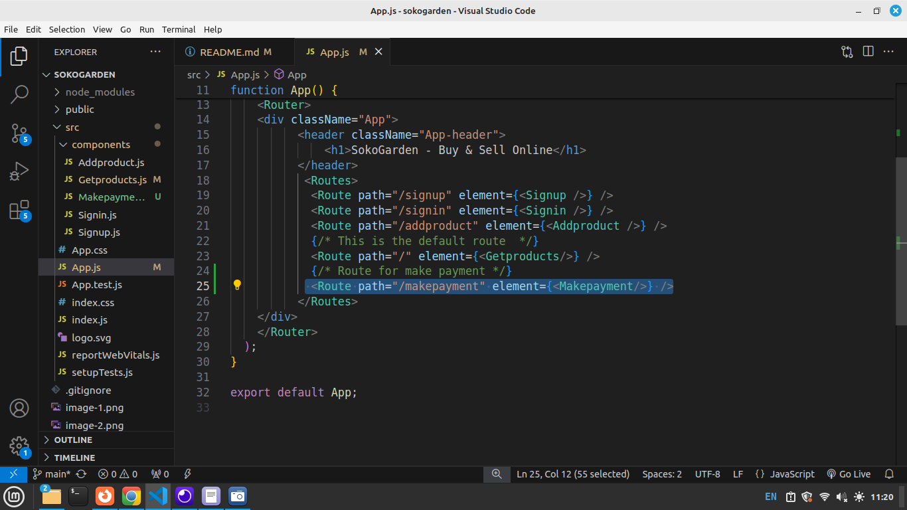

Test the route
Run your App <br>
Runs the app in the development mode.\
Open [http://localhost:3000/makepayment](http://localhost:3000/makepayment) to view it in your browser.
<br>
Output<br>

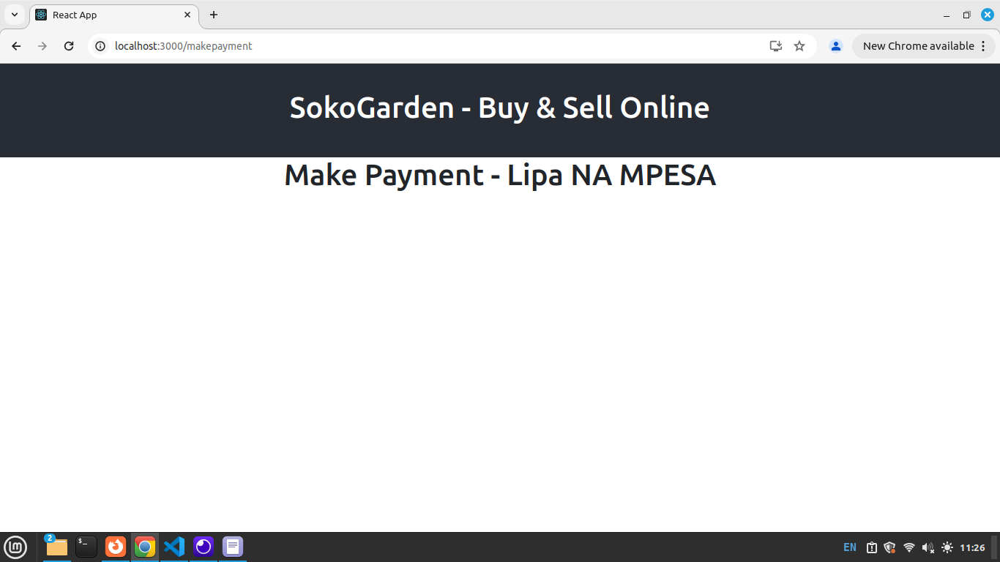

<br>
<b>Implementing the LIPA NA MPESA Logic </b><br>
To make our App have MPESA Integration, First we need to add some code in Getproducts.js

Open Getproducts.js and locate the <b>'Purchase Now'</b> Button in JSX.
Currently our Button looks like below <br>
```jsx
 <button className="btn btn-dark mt-2 w-100">Purchase Now</button>
```

Update above Code to;

```jsx
<button 
            className="btn btn-dark mt-2 w-100"
            onClick={() => navigate('/makepayment', { state: { product } })}>
            Purchase Now
</button>
```

Above, onClick 'Purchase Now' Button, we navigate to /makepayment, as we navigate we carry/parse the all the details of the current product that was clicked. 
we use <b>{ state: { product } }</b> <br>


Open Makepayment.js <br>

Import required modules

```jsx
import { useState } from 'react';
import {Link, useLocation} from 'react-router-dom'
```

Receive the product parsed from Getproducts Component, using the Purchase Now Button. <br>

Here, we make use of useLocation() Hook. <br>

```jsx
//We Receive the product in Makepayment
    //We use useLocation to receive the product
    const {product} = useLocation().state || {};
    //console.log("Res: "+product.product_name)
```
<b>seLocation() </b><br>
The useLocation() hook is a feature from React Router that helps you access information about the current URL in your app. It allows you to read the URL’s path, search variables in a component.
<br>

using useLocation(), we are able to retrieve 'product' in Makepayment Component. <br>


In JSX Code, Bind the product_name and product_cost in JSX <br>

```jsx
  return(
        <div>
            <h1>LIPA NA MPESA</h1>
            {/* Bind product name and Cost */}
            <p>Product NAME: {product.product_name}</p>  
            <p>Product Cost: {product.product_cost}</p>
      
        </div>
    )
```


Run your App<br>
Open [http://localhost:3000/makepayment](http://localhost:3000/makepayment) to view it in your browser.<br>
Output<br>

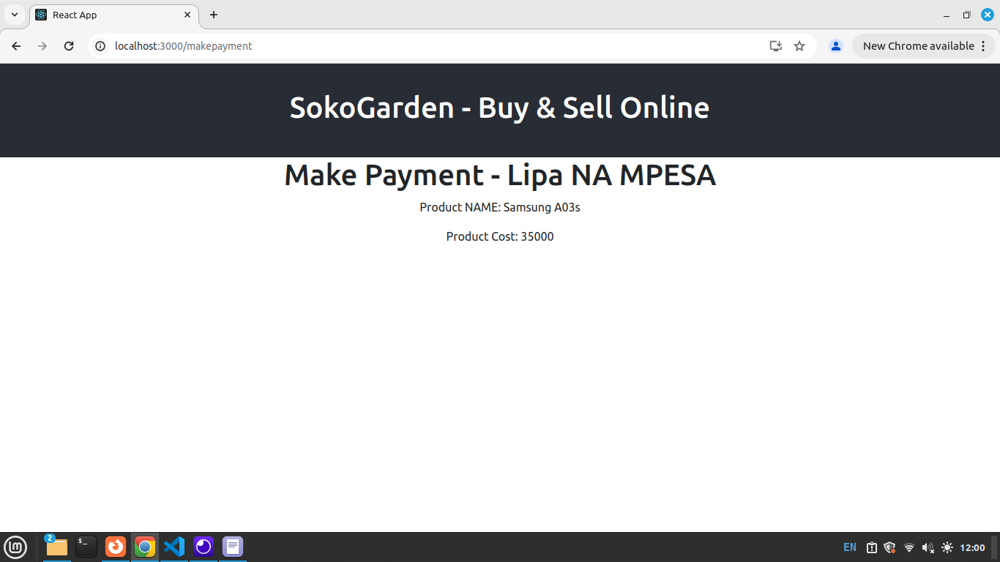


Next, Create below hooks states to hold the phone number and a success  message

```jsx
//Hooks to Hold Phone Number and success Message
    const [phone, setPhone] = useState("")
    const [message, setMessage] = useState("")
```
<br>
In JSX, Add Form that will request for user Phone Number, this is the Phone Number number used in Payment. <br>
In below form as user types we update the phone Hook using the setPhone() updater function. <br>

```jsx
 return(
        <div>
            <h1>LIPA NA MPESA</h1>
            <p>Product NAME: {product.product_name}</p>  
            <p>Product Cost: {product.product_cost}</p>
      
            <form>
                  <input 
                     type="text" 
                     placeholder='Enter Phone Number'
                     value={phone}
                     onChange={(e)=>setPhone(e.target.value)}/> <br /><br />
                  <button className='btn btn-dark'>
                       Make Payment
                  </button>
            </form>
        </div>
    )
```


Run your App<br>
Open [http://localhost:3000/makepayment](http://localhost:3000/makepayment) to view it in your browser.<br>
Output<br>

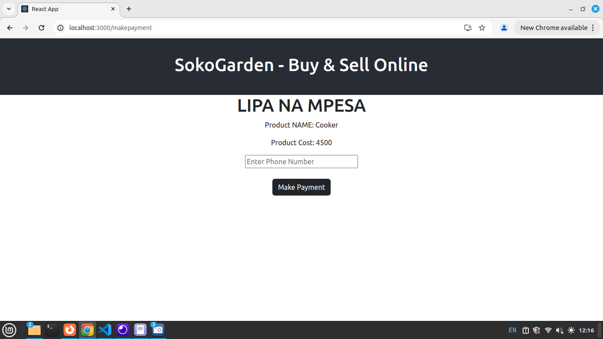

<br>
Create a submit function to send phone and amount to our Backend Payment API.
<br>

```jsx
   //Create a submit Function
    const submit = async(e) =>{
        e.preventDefault(); // prebent default JS actions
     //Update loading Hook with a message
     setMessage("Please wait as we Processs!");

      // Put updated hooks in data variable
      const data = new FormData();
      data.append("phone", phone);
      // Direcly parse the amount from product variable.
      // We use product.product_cost
      data.append("amount", product.product_cost);

      //post your data to your Payment Backend API
      const response = await axios.post(
        "https://modcom2.pythonanywhere.com/api/mpesa_payment",
        data
      );
      //Update message Hook with a new message
      setMessage("Please Complete Payment on Your Phone")
    }
```

Finally, in the Form opening tag Call the submit Function and bind the message Hook for status messages <br>

```jsx
<form onSubmit={submit}>
       {message}
         ....
```
<br>

Full Makepayment.js Code <br>

```jsx

import { useState } from 'react';
import {useLocation} from 'react-router-dom'
import  axios  from 'axios';
const Makepayment = ()=> {
    // Extract the received product using useLocation()
    const { product } = useLocation().state || {}; 
    //Hook to Hold Phone Number
    const [phone, setPhone] = useState("")
    const [message, setMessage] = useState("")
    
    //Create a submit Function
    const submit = async(e) =>{
        e.preventDefault(); // prebent default JS actions
     //Update loading Hook with a message
     setMessage("Please wait as we Processs!");

      // Put updated hooks in data variable
      const data = new FormData();
      data.append("phone", phone);
      data.append("amount", product.product_cost);

      //post your data to your Backend API
      const response = await axios.post(
        "https://modcom2.pythonanywhere.com/api/mpesa_payment",
        data
      );

      setMessage("Please Complete Payment on Your Phone")
    }

    return(
        <div>
            <h1>LIPA NA MPESA</h1>
            <p>Product NAME: {product.product_name}</p>  
            <p>Product Cost: {product.product_cost}</p>
      
            <form onSubmit={submit}>
                   {message}
                  <input 
                     type="text" 
                     placeholder='Enter Phone Number'
                     value={phone}
                     onChange={(e)=>setPhone(e.target.value)}/> <br /><br />
                  <button className='btn btn-dark'>
                       Make Payment
                  </button>
            </form>
        </div>
    )
}

export default Makepayment;
```
<br>
<b>Summary</b> <br>
In above Step 8; <br>
1. We click 'Purchase Now' Button from Getproducts.js Component. <br>
2. Parse the product details to Makepayment.js. <br>
3. In Makepayment.js, the parsed product is received using useLocation() <br>
4. The received product details are extracted and binded in JSX<br/>
5. We create a Form to request user Phone Nuumber, Update Hooks and Submit data to our Backend API.<br>
<br>

Run your App<br>
Open [http://localhost:3000/](http://localhost:3000/) to view it in your browser.<br>
Output<br>

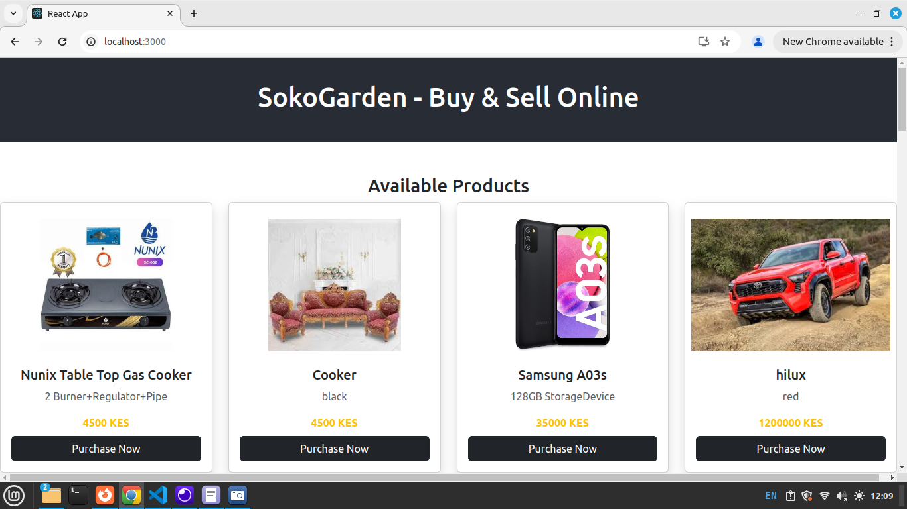

All products are displayed above. <br>

Click on <b>'Purchase Now' </b> Button. Below Screen Shows. Observe that the product you clicked is displayed in below screen. Showing the name and Cost. Type phone number and Makepayment.


An MPESA prompt - STK PUSH is sent to Your Phone. Enter PIN and Make a Purchase. <br>


<br>

### Step 9: Navigation/Navbar
In this step, we create a navigation within the App.
1. Navigate from Get Products to Add Product. <br>
Open Getproducts.js and add below navbar <br>
Add this code inside the root Div.

```jsx
<nav className="m-4">
            <Link to='/addproduct' className="btn btn-dark mx-2">UPLOAD PRODUCTS</Link>
            <Link to='/signin' className="btn btn-dark mx-2">Sign In</Link>
            <Link to='/signup' className="btn btn-dark mx-2">Sign Up</Link>
</nav>
```
Above makes users Navigate from Get Products to Upload Products, Signin and Signup. <br>


2. Navigate from Add Product to Get Products. <br>
Open Addproduct.js and add below navbar <br>
Add this code inside the root Div.

```jsx
<nav className="m-4">
      <Link to='/' className="btn btn-dark">GET ALL PRODUCTS</Link>
</nav>
```


Run your App<br>
Open [http://localhost:3000/](http://localhost:3000/) to view it in your browser.<br>
Output<br>
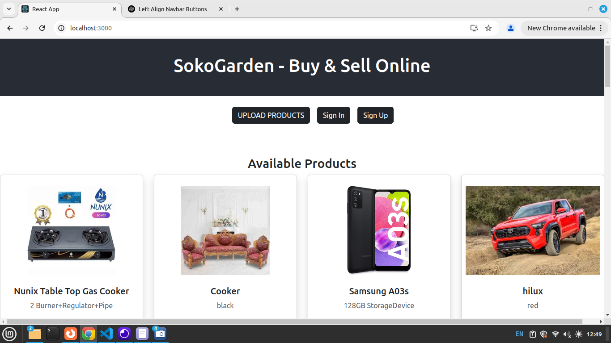

<br>
Users can now navigate from;<br> 
1. Getproducts to Addproducts, Signin and Signup. <br>
2. Addproduct to Getproducts.

<br>

### Conclusion
Throughout this Full Stack Development module, we successfully built a complete Full Stack application—<b>SokoGarden</b>. The frontend was developed using <b>JavaScript and React.js</b>, while the backend was powered by Python Flask Framework with an SQL Database. API testing was conducted using Insomnia (https://insomnia.rest/), and the API was hosted on <b>PythonAnywhere.</b>.

<br>
This project provided hands-on experience in integrating frontend and backend technologies, API development and testing, database management, and deployment. By working on <b>SokoGarden</b>, students have gained proficiency in building, testing, and deploying Full Stack applications—a crucial skill set for real-world software development.
<br><br>
You can explore the project further using the links below:<br>
🔹 Frontend Repository:SokoGarden Frontend:  https://github.com/modcomlearning/sokogarden<br>
🔹 Backend Repository: SokoGarden Backend API: https://github.com/modcomlearning/BackendAPI  <br>
🔹 App Link : https://sokogarden.vercel.app/ <br>

<br>
<b>Well done on reaching this milestone! Keep building, keep learning, and happy coding!</b>
<br>
<i>Note: Before Proceeding to the Next Module - Android Apps Development, we need to create Full Stack Application Projects</i> <br>.

### Next, Steps.
Now that you’ve successfully completed the SokoGarden project, it's time to take your skills to the next level!<br>

✅ Challenge: Build upon the foundation of SokoGarden by coming up with a new eCommerce concept. 
<br>

 #### Guideline
 Students' must<br> 
🔹 Apply what they have learned in a real-world project. <br>
🔹 Come up with an idea. <br>
🔹 Identify what specific Products/Services your application is dealing with.<br>
🔹 Customize the frontend and backend to fit your Concept. <br>
🔹 Enhance the Frontend User Interface - Look and Feel. <br>
🔹 Come up with any new features <br>
🔹 New Features i.e Carousel, Footers, About Us, Share Products,Filter, Delete etc <br>
🔹 Demonstrate understanding of Full Stack Development Concept - Frontend-Backend. <br>
<br>

### Notes
Building upon the SokoGarden project offers students a comprehensive understanding the CONCEPT of Full Stack Development. This experience enables them to grasp the essential components of full-stack applications, including: <br>

<b>Frontend Development:</b> Crafting user interfaces using technologies like HTML, CSS, and JavaScript frameworks such as React.js.<br>
<b>Backend Development:</b> Implementing server-side logic with languages like Python and frameworks such as Flask.
<br>
<b>Database Management: </b> Handling data storage and retrieval using SQL databases.
<br>

Engaging in this project equips students with the versatility to tackle various applications in the industry. The foundational concepts learned are transferable across different projects, as full-stack development principles remain consistent. <br>This adaptability ensures that students are well-prepared to meet diverse market demands.
<br><br>
<b>🚀 Get creative and start building! </b> 💡💻 <br>

<b>Credits </b>
The successful completion of the SokoGarden project was made possible through the dedicated efforts and unwavering support of the MODCOM Institute trainers and management. Their commitment to providing software training and hands-on experience has been instrumental in guiding students through this comprehensive full-stack development journey. 
<br>
Stay updated with our latest news and events by following us on X @ModcomKenya <br><br>
Website : https://modcom.co.ke <br><br>
Thank you all for making this project a success!.


