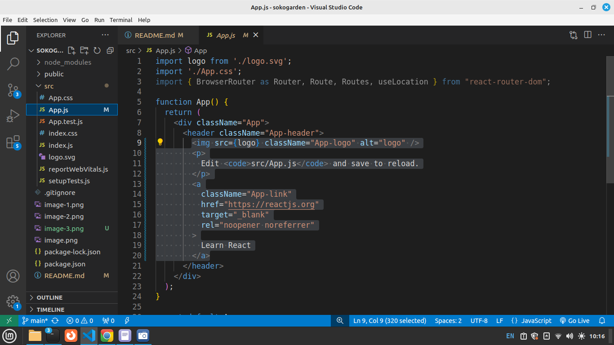

# Getting Started with Create React App

This project was bootstrapped with [Create React App](https://github.com/facebook/create-react-app).

In your class Main folder, create a react app using below command
  
  npx create-react-app sokogarden

Runs the app in the development mode.\
Open [http://localhost:3000](http://localhost:3000) to view it in your browser.

The page will reload when you make changes.\
You may also see any lint errors in the console.

Your React App runs as below on the browser.

Lets Edit our App.
in src Folder open App.js and remove the higlighted code in below screen.

Replace the code yu removed with a heading and as shown below.

Run your App 
Runs the app in the development mode.\
Open [http://localhost:3000](http://localhost:3000) to view it in your browser.
 
<b>Install React Router </b>  

   npm install react-router-dom

React Router will be used to create navigation in our App.
 

